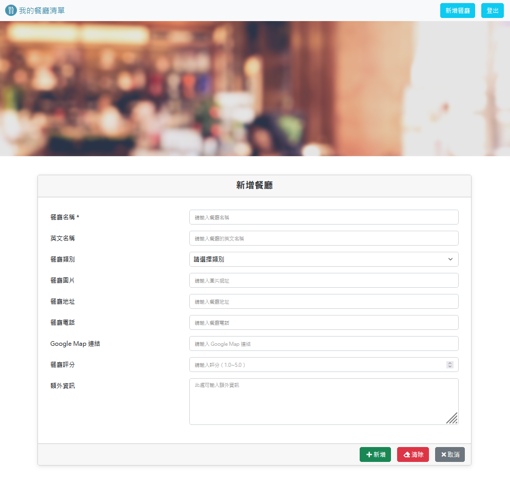

# 我的餐廳清單

提供一個平台讓使用者可以瀏覽、管理喜愛的餐廳資料。




## 功能

- 進行註冊、登入來管理餐廳資料。
- 可以使用 Facebook 登入。
- 可以瀏覽所擁有的全部餐廳資料，或是個別餐廳的詳細資訊。
- 可以新增、編輯餐廳的資訊，或是刪除特定餐廳的資料。
- 可透過餐廳地址 URL 連結到 Google 地圖。
- 可透過名稱或類別搜尋餐廳。
- 可按照指定規則排序餐廳。

## 環境要求

- Node.js v18
- MySQL v8

## 安裝

1. clone 本專案後 cd 至專案資料夾，並執行以下命令安裝相關套件。

```
npm install
```

2. 至 `config/config.json` 檔案調整資料庫相關設定，並執行以下命令進行資料庫環境建置。

```
npm run db_setup
```

3. 依照 .env.example 範例創建 .env 檔。

```
SESSION_SECRET={{YOUR_SESSION_SECRET}}

FACEBOOK_CLIENT_ID={{YOUR_FACEBOOK_CLIENT_ID}}
FACEBOOK_CLIENT_SECRET={{YOUR_FACEBOOK_CLIENT_SECRET}}
FACEBOOK_CALLBACK_URL=http://localhost:3000/oauth/redirect/facebook
```

4. 設置環境變數 NODE_ENV=development，並使用以下命令來執行本專案。

```
npm run start
```

5. 啟動伺服器後，開啟瀏覽器連線至網頁 http://localhost:3000。

```
可使用以下兩組帳號密碼進行登入

- 帳號：user1@example.com / 密碼：12345678
- 帳號：user2@example.com / 密碼：12345678
```
